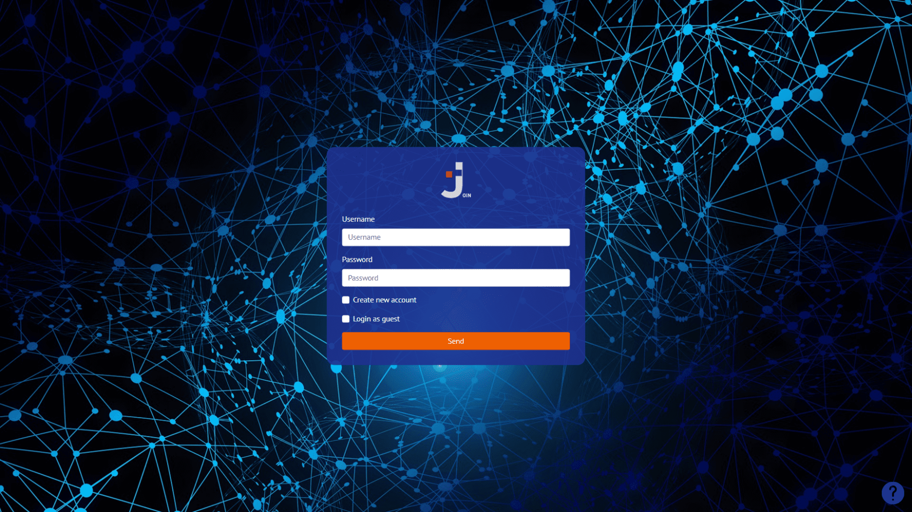
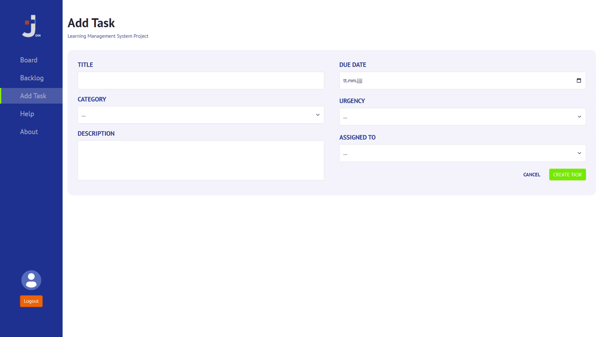
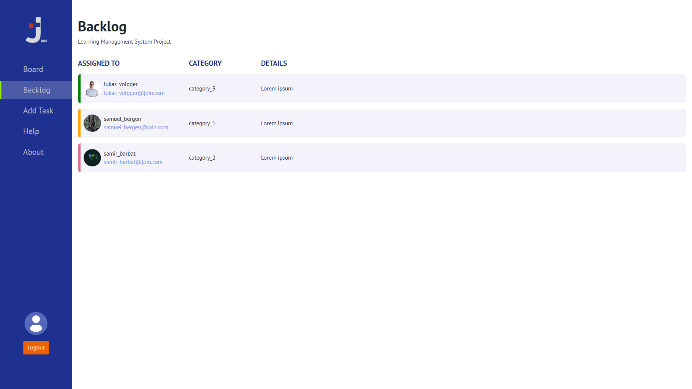

# Join
Join is a team project of the frontend web developer course at the [Developer Akademie](https://developerakademie.com/). The focus is on HTML, CSS, JS and working with version control Git with multiple collaborators. The Bootstrap design framework was used in this project.

In this project, the client - server functionality was simulated with a mini-backend (More information can be found in the repository [smallest_backend_ever](https://github.com/LukasVolgger/smallest_backend_ever). The data is not stored locally in local storage but on a server in Json format.

**If you like the app, please leave a star and check out the collaborators!**

**Table of Contents**

- [Join](#join)
  - [Features](#features)
  - [Preview](#preview)
  - [Run the Application](#run-the-application)
    - [1. Requirements](#1-requirements)
    - [2. Clone the Source](#2-clone-the-source)
    - [3. Start the Application](#3-start-the-application)
  - [Feedback \& Support](#feedback--support)
  - [License](#license)
    - [Graphics](#graphics)
    - [Source Code](#source-code)

## Features
Here is an overview of the most important functions of the project.

**Available Languages**

- English
  
**Functionality**
  
- Simulation of a simple login function using JS. User input is stored and read in encrypted form
- Tasks can be created. The entries must be complete and are validated by the bootstrap form validation
- The created tasks are then collected in the backlog. Here they can be edited again, deleted or sent to the board
- Depending on the processing status, tasks can be moved in the board using drag & drop. The tasks can also be edited or removed here
- The Help page provides an easy-to-understand user guide
- Legal information can be found on the About page
- All tasks and users are stored on an FTP server
- Responsive Webdesign

## Preview



---



---



## Run the Application
Follow these steps to run the application.

### 1. Requirements
All you need is a web browser like one of the following:

- [Google Chrome](https://www.google.com/chrome/)
- [Mozilla Firefox](https://www.mozilla.org/en-US/firefox/new/)
- [Microsoft Edge](https://www.microsoft.com/en-US/edge)


### 2. Clone the Source
Clone the source code or download the repository on your local computer by clicking the **Code** button.

``` bash
git clone https://github.com/LukasVolgger/join.git
```

### 3. Start the Application
Navigate to the location on your computer where you cloned/downloaded the code. In the project directory, open the **index.html** file with a web browser.

## Feedback & Support
Your feedback is invaluable, and I'm here to assist you with any questions or concerns. Your input plays a crucial role in enhancing the project and optimizing the user experience. Feel free to reach out to me:

- **Feedback:** Share your thoughts, suggestions, or ideas with me so that I can continuously work towards improvement.

- **Support Inquiry:** If you encounter difficulties or need assistance, [create a new GitHub issue](https://github.com/LukasVolgger/join/issues/new). Please describe your issue in detail to enable me to provide quick and accurate support.

Thank you for your support!

## License
Please note the following license terms with regard to the graphics used and the source code.

### Graphics
<!-- 2. Online Courses -->
All graphics/images are property of [Developer Akademie](https://developerakademie.com/). The graphics are left to the participants of the course for learning purposes for use in the projects and are subject to the copyright of the [Developer Akademie](https://developerakademie.com/).


### Source Code
The source code is subject to the following license:

[MIT License](./LICENSE.md)
