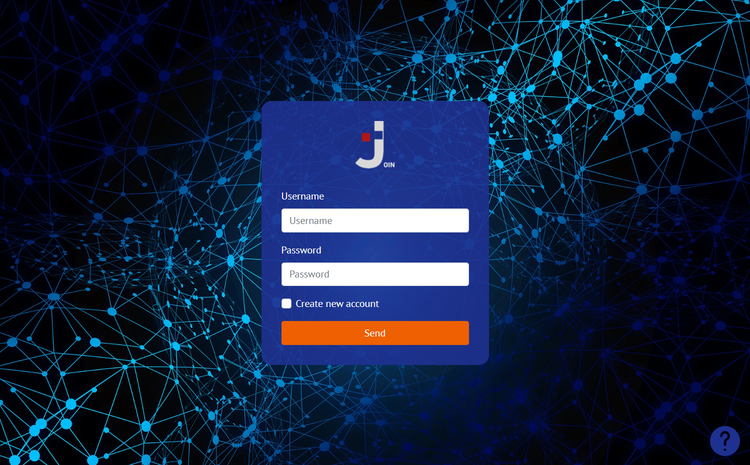
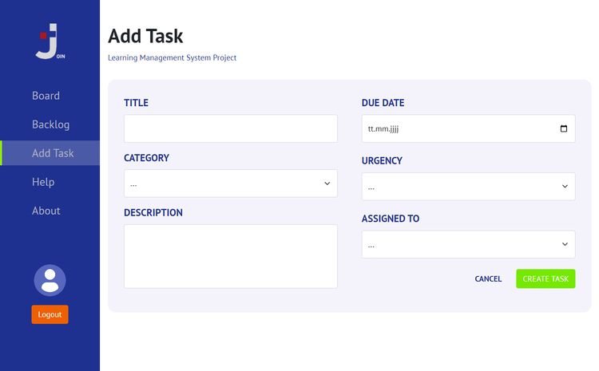
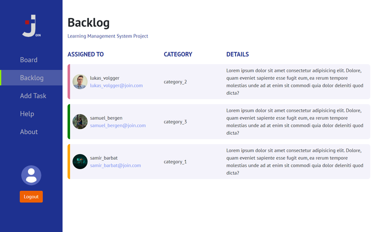
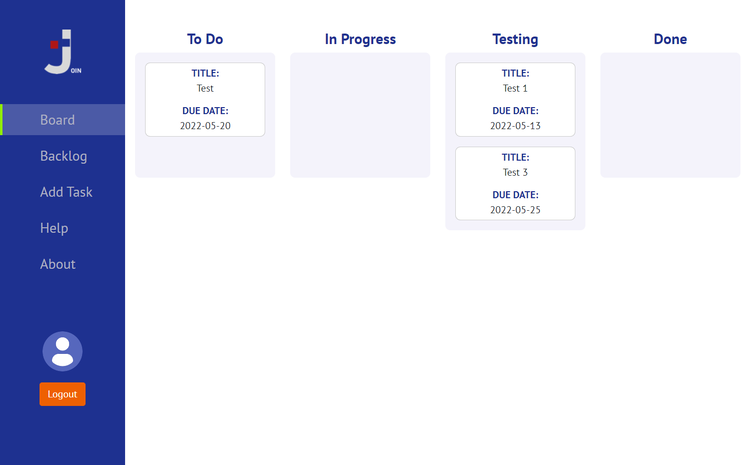
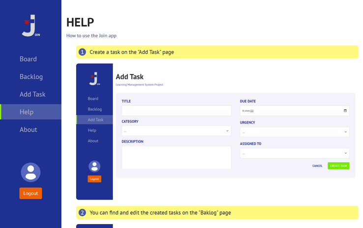

<h1>Join</h1>

Join is a team project of the frontend web developer course at the <a href="https://developerakademie.com/">Developer Akademie</a>. The focus is on HTML, CSS, JS and working with version control Git with multiple collaborators. The Bootstrap design framework was used in this project.  
 
In this project, the client - server functionality was simulated with a mini-backend (More information can be found in the repository <a href="https://github.com/LukasVolgger/smallest_backend_ever">smallest_backend_ever</a>). The data is not stored locally in local storage but on a server in Json format.  
 
<b>If you like the app, please leave a star and check out the collaborators!</b>

<b>COLLABORATORS:</b>

- <a href="https://github.com/SamirBarbat2020">Samir BARBAT</a>
- <a href="https://github.com/samuelbergen">Samuel BERGEN</a>
- <a href="https://github.com/LukasVolgger">Lukas VOLGGER</a>

<b>IMPORTANT:</b> Please note that learning projects focus on the given tasks. It is therefore possible that some functions do not work or are not scripted.
<h3>Table of Contents</h3>

- <a href="#features">Features</a>
- <a href="#preview">Preview</a>
- <a href="#installation">Installation</a>
- <a href="#license">License</a>

<h2 id="features">Features</h2>
Here is an overview of the most important functions of the project. Click on the summary to expand. 

 

<b>Available Languages</b>

  
:heavy_check_mark: English  
  

<b>Functionality</b>

  
:heavy_check_mark: Simulation of a simple login function using JS. User input is stored and read in encrypted form  
:heavy_check_mark: Tasks can be created. The entries must be complete and are validated by the bootstrap form validation  
:heavy_check_mark: The created tasks are then collected in the backlog. Here they can be edited again, deleted or sent to the board  
:heavy_check_mark: Depending on the processing status, tasks can be moved in the board using drag & drop. The tasks can also be edited or removed here  
:heavy_check_mark: The Help page provides an easy-to-understand user guide  
:heavy_check_mark: Legal information can be found on the About page  
:heavy_check_mark: All tasks and users are stored on an FTP server  
:heavy_check_mark: Responsive Webdesign  
  

<h2 id="preview">Preview</h2>

---

---

---

---

<h2 id="installation">Installation</h2>
Follow these steps to install/test the project.

<h3 id="requirements">1. Requirements</h3>
<h4> 1.1. You need a web browser like one of the following:</h4>

  <h4>1.2. Download and set up the mini-backend:</h4>
  
  https://github.com/LukasVolgger/smallest_backend_ever

<h3>2. Download the Source</h3>
Download the source code or clone the repository on your local computer by clicking the <b>Code</b> button.
 
 

  
<h3>3. Configuration</h3>
After the <a href="https://github.com/LukasVolgger/smallest_backend_ever">smallest_backend_ever</a> is set up, set the url in <a href="https://github.com/LukasVolgger/join/blob/main/scripts/main.js">main.js, line 11</a> to your url of the backend:
 
 

<h3>4. Start the Project</h3>
Navigate to the location on your computer where you downloaded/cloned the code. In the project directory, open the <b>index.html</b> file with a web browser.
 
 

<h2 id="license">License</h2>

Some graphics are property of the <a href="https://developerakademie.com/">Developer Akademie</a>. The graphics are left to the participants of the course for learning purposes for use in the projects and are subject to the copyright of the <a href="https://developerakademie.com/">Developer Akademie</a>.

The source code is subject to the following license:

